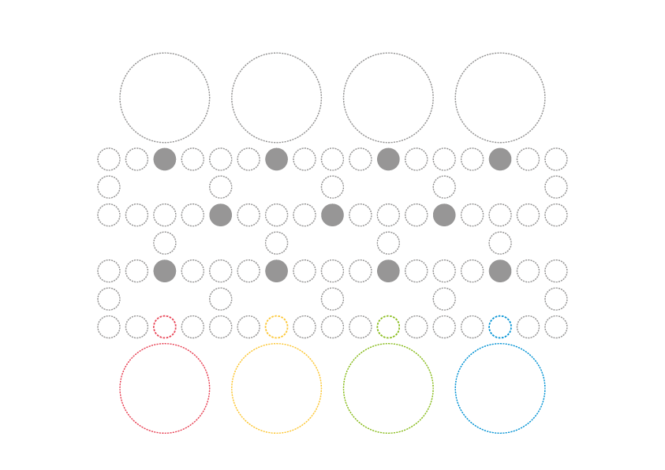
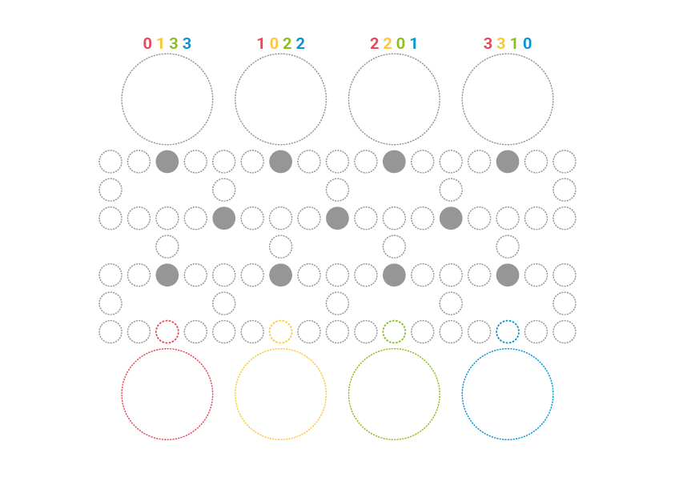
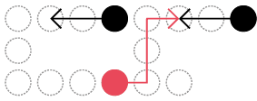
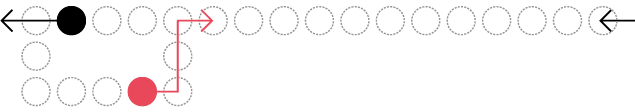

# Week 1 ~ Barricade + filter bubbles

[Read the game analysis on Medium ↱](https://medium.com/10-game-hacks-in-10-weeks/week-1-barricade-filter-bubbles-c7d43977b9e5) 

### Experiment 1: remove the bottleneck

Whilst playing Malefiz/Barricade I observed that towards the end the game gets rather boring, as players line up on the last row waiting to roll the exact number of steps that will lead them through the **one and only exit**.

Michael Debije wrote pretty much the same [in this thread on BGG](https://www.boardgamegeek.com/thread/172844/block):

> Unfortunately, the game often ends with two or more players alternating attempts to roll 1 to displace the last barricade or leave the board. The game also lasts about 15 minutes longer than you’d really like it to, so the endgame drags a bit.

So I redesigned a **shorter** game board with **four exits**:

Players can leave the board from any of them.

Also, you don't have to roll the exact number of steps that separate you from an exit but just enough to get through. For example, if you are two steps away from an exit, rolling a 2 or anything above will allow you to reach the exit.

### Experiment 2: take a walk on the wild side

The *four exits* hack introduced an imbalance: each player has a shorter path to one or two exits. Why would they go to the furthest exit if they could just leave the board from the nearest one(s)? To balance the different lengths I added an incentive: the further an exit is from your start, the more points you gain when reaching it. 

> Symbolically, you would get rewarded for trying a different side and hearing a different perspective, instead of sticking to the same opinion.

#### When does the game end?

Good question.

When a player exits all their pieces, the game ends and everyone counts their points. The player(s) with the highest score win(s).

It may well be that the player who completed the *race* has less points than other players. 	

### Experiment 3: the moving algorithms

The **obstacle** elements from Malefiz/Barricade become **algorithms** that adapt to your moves and influence your path.

> This is the new mechanic to play-test: whenever you move a piece to the left or right, the obstacle/algorithm closest to that piece moves in the opposite direction.

Like in a filter bubble, the obstacle/algorithm moves to create a bias for you to keep moving the way you moved.

In the example above, the red piece moves four steps in total, and if we consider only the horizontal movement **two steps to the right**. From its landing place, the closest algorithm (black circle) then moves **two steps to the left**.  

This simple *mechanic* introduces a new *dynamic*: you start planning your moves based on what the algorithms will do. 

It also introduces a few questions (and temporary answers):

* What if an algorithms lands on a piece? 

	That piece gets trapped until the algorithm moves again.
	
* What if you land on a space that is *equidistant* from two or more algorithms? 	

	They all move in the opposite direction.
	
	
	
* What if an algorithm lands on another algorithm? 

	You stack them on top of each other. When they're next due to move, only the top one will move.
	
* What if a piece gets blocked by more than one algorithm? 

	Only the top algorithm moves, so it will take at least two turns to unblock the piece.

* What if you unblock another player's piece? Two options to be play-tested:

	a) Nothing happens, you have just been kind. Hopefully they will return the favour later.
	
	b) There is some sort of incentive for this.
	
* What if an algorithm gets stuck in a corner? A few options to be play-tested:

	a) Algorithms can only move horizontally, and when they reach a corner they **bounce back**.
	
	b) Algorithms can only move horizontally, and when they reach a corner they continue from the other end of the line.
	
	
	
	b) Algorithms can also move vertically, so when they reach a corner they continue up or down. Interesting but slightly confusing perhaps...
	
### Experiment 4: one die to roll them all	

Whilst playing the previous experiments, I observed that luck still plays a remarkable role in this game. With a few lucky throws you can get a piece very close to an exit.

There's nothing bad with **chance** per se, but I'd like to minimise it in favour of **strategy**.

Also, rolling a die takes time, however little. 

What if the die is rolled only once per turn, and everyone has to use that number to move their pieces? For example, if you roll a 6 (it doesn't really matter who throws the dice, it could be always the same player or you could take turns) everyone will move one of their pieces 6 steps.
 
This way there is still chance, but it's *fairly distributed*.

 

